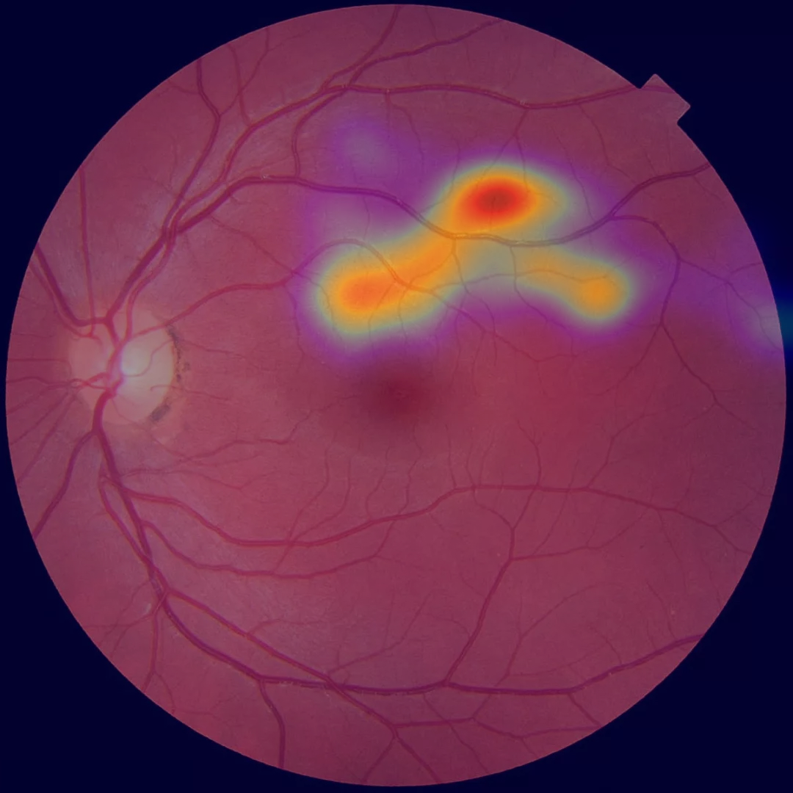

# 👁️‍🗨️ 眼动追踪热力图项目

**负责人**：余梓平

**邮箱**：[19529230428@163.com](mailto:19529230428@163.com)


## 📑 目录

1. ✨ 项目简介与核心功能
2. 🛠️ 环境配置与使用准备
3. 🧑‍💻 实际使用操作流程
4. 📝 开发过程与工作日志
5. 🗂️ 项目文件结构说明

---

## ✨ 项目简介与核心功能


本项目由汕头大学·香港中文大学联合汕头国际眼科中心开发，旨在通过摄像头捕捉用户眼球注视行为，并利用热力图的方式进行可视化分析，辅助科学研究与眼科评估。

### 🧩 主要组成与技术说明

* **前端页面与交互**
  基于 [Node.js](https://nodejs.org/) 框架开发，实现多页面网站结构：

  * 首页
  * 测试页面
  * 测试结果页面
  * 关于页面

* **眼球动作捕捉**
  使用 [WebGazer.js](https://webgazer.cs.brown.edu/) 插件，通过浏览器调用摄像头，实时跟踪用户注视位置。
  **WebGazer 原理简介**：

  * 👁️ **面部识别与点云**：系统检测到人脸后，显示绿色框，并在脸上绘制多个“面部特征点”（点云），用于定位五官并估算视线方向。
  * 🎯 **九点校正**：测试前，用户需依次点击九个红点（每点至少5次），并保持注视，提升追踪准确度。

* **热力图生成**
  所有眼动数据（用户注视屏幕坐标）保存后，由 Python 脚本自动绘制热力图。

  * **依赖库**：

    * 标准库：`os`, `json`
    * 第三方库：`numpy`, `matplotlib`, `Pillow (PIL)`, `scipy.ndimage`（其中 `gaussian_filter` 用于数据平滑和热度区渲染）
  * **绘制方式**：利用 `matplotlib.pyplot` 绘图，`scipy.ndimage.gaussian_filter` 进行密度平滑，最终可视化注视高密度区域。

---

## 🛠️ 环境配置与使用准备

本项目分前端（网页）和后端（热力图生成）两部分，请**按顺序**操作：

### 1️⃣ 安装 Node.js 相关依赖

打开命令行窗口，进入项目文件夹，依次输入：

```bash
npm install
npm start
```

启动后，浏览器访问提示的本地端口进行访问。

### 2️⃣ 配置 Python 环境（热力图生成）

1. 进入 `result` 文件夹

2. 创建 Python 虚拟环境并激活（建议 Python 3.8 及以上）：

   Windows:

   ```bash
   python -m venv venv
   .\venv\Scripts\activate
   ```

   macOS/Linux:

   ```bash
   python3 -m venv venv
   source venv/bin/activate
   ```

3. 安装依赖包（根据 `requirements.txt`）：

   ```bash
   pip install -r requirements.txt
   ```

### 3️⃣ 测试图片与目录准备

* 🖼️ **测试图片**：将所有测试图片以数字编号命名（如 `1.jpg`, `2.jpg`…），放入 `public/test_imgs/`。
* 📂 **数据保存目录**：

  * 眼动坐标数据：`result/data/`
  * 生成热力图：`result/heatmap/`

> ⚠️ 若缺少图片或目录，程序会提示“找不到测试图片”，请务必按要求放置。

---

## 🧑‍💻 实际使用操作流程

本项目**无需编程基础**，按以下步骤操作：

### 1️⃣ 进入首页

打开浏览器，访问本地网址如 http://localhost:3000 进行测试。

### 2️⃣ 启动摄像头并校正

1. 点击允许摄像头权限。
2. 等待“WebGazer服务已启动”提示，绿色人脸框及面部特征点云（👾）出现。
3. 依次点击九个红点，每点至少点击5次，保持注视并固定头部。

### 3️⃣ 进行图片注视测试

* 校正完成后，按“下一张”依次测试所有图片，每张注视 1–2 秒以上。
* 可以暂停测试，或切换页面（切换会提示中断）。
* 数据实时保存，无需手动操作。

### 4️⃣ 查看测试结果与热力图

* 测试结束后，系统自动调用 Python 脚本生成热力图。
* 在“测试结果页面”，点击“更新结果”查看最新热力图（会覆盖旧图）。



所有数据和图片保存在 `result` 文件夹内。

---

## 📝 开发过程与工作日志

### 💡 开发逻辑说明

* 打开网页后先到简介页
* 点击“开始测试”进入校正→测试→热力图流程
* 校正时每点至少5次，确保准确度
* 测试中断或缺图均有提示
* 完成测试后自动绘图展示

### 📊 精度与结果分析

* 5 位同学共 50 次测试，头部移动准确率约50%；固定头部且充分校准时，准确度可达约70%。
* 增加校正次数并固定头部能进一步提升精度。

### 🕓 项目工作日志

| 日期         | 工作内容                     |
| ---------- | ------------------------ |
| 2025.03.02 | 完成 Node.js 学习            |
| 2025.03.16 | 嵌入 WebGazer 至 Node.js 项目 |
| 2025.04.04 | 程序逻辑设计                   |
| 2025.05.22 | 首次场景调试                   |
| 2025.06.09 | 多设备摄像头精度测试               |
| 2025.06.20 | Python 热力图实现             |
| 2025.07.13 | Bug 调试与脚本整合              |
| 2025.07.15 | 多用户最终测试                  |
| 2025.07.23 | 项目打包发布                   |

---

## 🗂️ 项目文件结构说明

以下为主要目录结构示意（部分依赖如 node\_modules/venv 已省略）：

```
project/
│
├── .idea/
├── node_modules/         # Node 依赖（自动生成）
├── public/
│   └── test_imgs/        # 测试图片（按编号命名）
├── result/
│   ├── data/             # 眼动数据
│   ├── heatmap/          # 生成热力图
│   ├── requirements.txt  # Python 依赖列表
│   └── *.py              # Python 绘图脚本
├── views/
├── package.json
├── package-lock.json
└── server.js
```

## 📬 联系方式

本项目负责人：**余梓平**
联系邮箱：**[19529230428@163.com](mailto:19529230428@163.com)**

> 如需添加许可证（License）或英文版说明，请联系补充！


